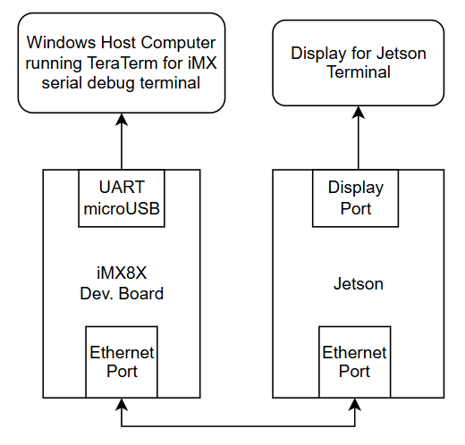
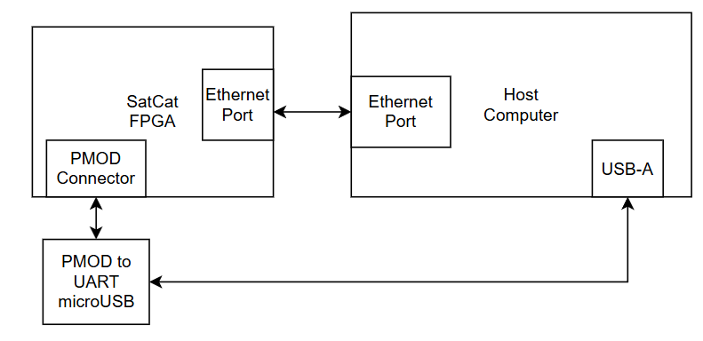
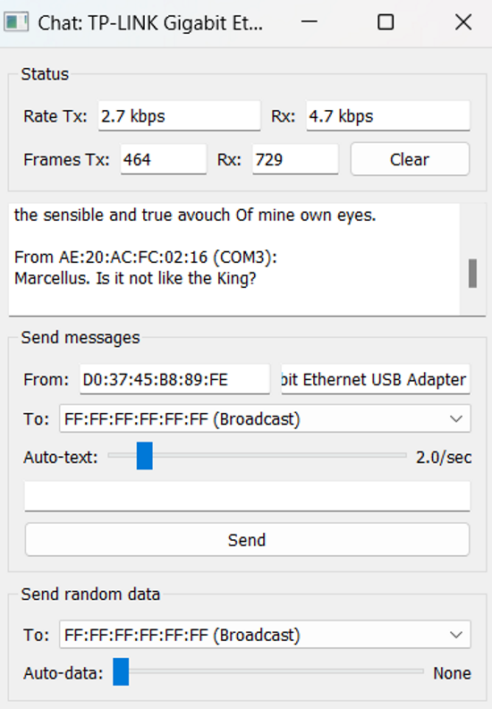
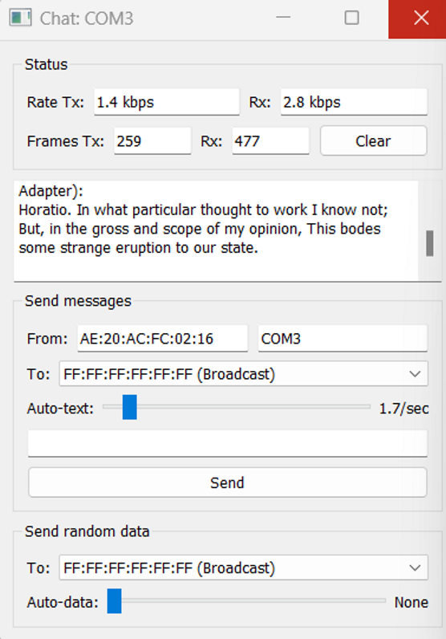
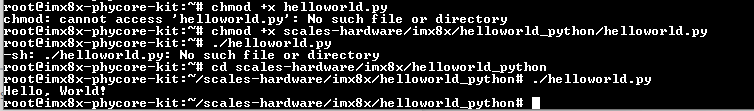

# FlatSat Development

This document is an overview of the current and future state of our FlatSat development for SCALES.

## Current Updates
### **Direct Ethernet Connection**

We are currently able to connect the boards directly in the following configuration:



From there, we have to set a temporary ip on the iMX, in this case it is set to 10.3.2.6 so we can ping the Jetson's ip.


We can also use the iMX to ssh into the Jetson:


And we can do the same process of pinging the iMX and ssh from the Jetson:


We are also able to copy files from the iMX to the Jetson. In this example, we copied a file called mcp9808a from the iMX to the Jetson:


### **SatCat**

We are currently only able to use SatCat to send/recieve messages from different serial ports within the same windows host computer. 

We followed [this example setup from SatCat's GitHub](https://github.com/the-aerospace-corporation/satcat5/tree/main/examples/arty_a7) to download the software onto the FPGA and set up the hardware in the following configuration: 



With the python chat client, we were able to get data transfer speeds on both UART and Ethernet:





This provided example only allows connection from SatCat to the COM ports of the local computer used, and NOT connection between different systems (which is what we need). This example also only supports one ethernet and one UART, and we would prefer to have 2 ethernet ports available. We tried using a UART to ethernet converter, but it didn't work. We believe this is mainly due to the verilog programmed onto the FPGA only being able to handle UART protocol for that port, so this is something we will have to look into as well. 

**Next Step:** Develop Verilog code to enable communication between two different external systems (Jetson to the flight computer) and communicate via two ethernet ports.


### **VOXL2**
The VOXL2 is currently bricked after attempting to update the software using the command "voxl-configure-mpa".

We followed the unbricking tutorial numerous times and encountered issues with VOXL's firmware files that fail to call on its own files when flashing the board. We submitted a ticket to the ModalAI forum two weeks ago and havent heard back.

The error we are receiving when attempting to flash the board is shown below:


**Next Step:** Reach out to ModalAI to get more assistance from the team to help debug.


### iMX 8X

For more details, take a look at [documentation](https://scales-hardware.readthedocs.io/en/latest/imx8x_procedures/).

**Main updates:**

- successfully re-flashed the operating system to a Yocto Linux kernel
- set up the SDK on a Linux host computer to cross compile code
- got an I2C sensor up and running with a C code executable file to read sensor data on the board
- able to copy code from GitHub instead of using as USB every time
- figured out how to run python code on the board
- started trying to get F Prime up and running on board

**Development Environment**

To run python code on the iMX, any python code file can be marked as executable and run on the board. For example, the following hello world python script runs as expected on the iMX:
```
#!/usr/bin/env python

print("Hello, World!")
```
The setup and output on the board looks like this:



For other languages including C and C++, code must be cross-compiled in the SDK on the Linux Host machine. We have currently tested this using both C and C++ code and compiliers. After the code is cross-compiled in the SDK, it generates an executable file that can be run on the iMX. For more information on the cross-compilation process, reference the [I2C Interfacing Guide](https://scales-hardware.readthedocs.io/en/latest/imx8x_procedures/#i2c-interfacing) from our docs. In that guide, we cross-compile C code to read data from an I2C temperature sensor and output the result in terminal on the board. 

**PhyTEC Guide Experience**

The guides from PhyTEC for this board are a bit rough to work with at times. Many of the issues we ran into during development were due to a lack of description and detail in the docs and guides. We mainly found that the guides are great at getting you started, but lack the explaination on how many of these interfaces and protocols can be used outside of basic setup. Some interfacing guides are better than others, though, and others can sometimes be outdated. There are also not many tutorials on compiling code, the only examples shown compile C++ code. This is something that may become a challenge later on in development. 

However, it is worthy to note that phyTEC's support team does reply quickly and consistently, usually within 1-2 days and with helpful feedback, which makes development a little easier. 

**F Prime Development**

We are in the process of getting F Prime deployed on the iMX. We made a [discussion post](https://github.com/nasa/fprime/discussions/3002#discussioncomment-11158814) on the F Prime GitHub going over our process and the current issues we have. We have recieved some feedback that will be looked into in the next few days.

Ideally we can get F Prime up and running in the next week or so, that way we can use it for real-time data transmission between boards instead of just copying over files over ethernet. 

## Future FLATSAT Plan

**General Goals**

- set up static ip address on the iMX
- fix F Prime deployment on the iMX
- set up sensor data transfer from iMX to Jetson using F Prime
- change SatCat verilog to work with external systems
- change SatCat verilog to work with ethernet instead of UART
- get the VOXL to work
- create a unified power system
   - right now, all FlatSat components are plugged into wall outlets, so we need to begin development on the power distribution block of the overall system architecture
   - ideally, we will be able to power the system with one source that is regulated and distributed to the proper components

After viewing the full capabilities of our chosen FPGA, we are currently comparing three different hardware architectures for our SCALES system:

### Architecture 1
Architecture 1 has sensors attached to the **flight computer**.


__Pros:__

- Lower power consumption from internal system (less ethernet ports)
- immediate sensor logging
- eliminates bandwidth limitation by having seperate data streams for each sensor

__Cons:__

- slightly longer sensor data transferring from the flight computer to the Jetson
- requires FPGA software development and custom FPGA board


### Architecture 2
Architecure 2 has sensors attached to **SATCAT**


__Pros:__

- Sensor data is accesible to both the flight computer and Jetson
- 5 GigEthernet Ports
- 22 Low speed ports (SPI, I2C, UART, CAN)
- slightly faster sensor data transfer directly from SatCat to Jetson

__Cons:__

- requires heavily modified FPGA software and custom FPGA board
- requires extra 2W to power all ports
- bandwidth limitation


### Architecture 3
Architecure 2 has **no SATCAT** and has sensors attached to the **flight computer**


__Pros:__

- easiest architecture to develop
- lowest power consumption
- no FPGA development
- one less source error

__Cons:__

- less communication ports
- more development needed on flight computer board (to enable more ethernet ports)


## Testing Metrics
These are the test metrics that will help make hardware design decisions:

- lowest power consumption
  - will be tested at component level and system level during different tasks including real-time inferencing and data transfer
- data transfer speed
- ease of use
   - hardware setup: How many internal connections are required? How long did it take to set up?
   - software setup: How much manual input do we have to put in to get the system to work? How long do certain critical tasks take?
   - amount of manual input/labor
- read/write ability: Are there any issues when flight computer and Jetson are trying to access the data at the same time?
- availability of I/O

**[Test Procedure](https://scales-hardware.readthedocs.io/en/latest/Test%20Procedure%20List/)**
