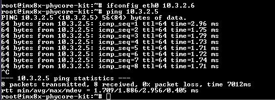
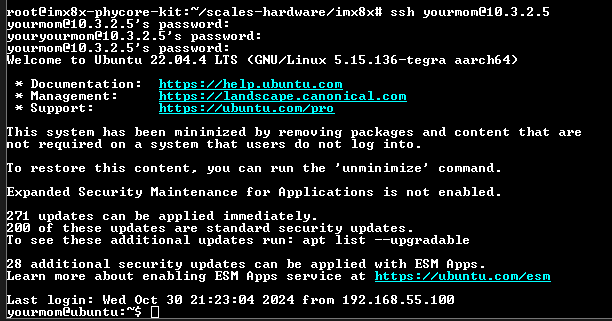
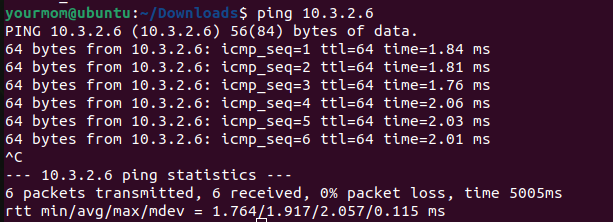
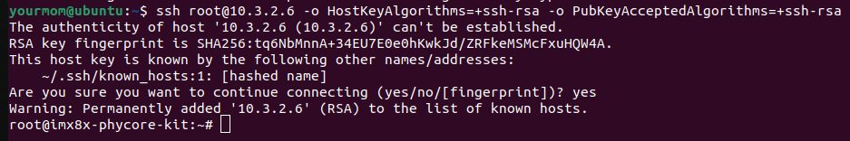
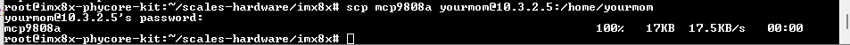

# FlatSat Development

This document is an overview of the current and future state of our FlatSat development for SCALES.

## Current Updates
### **Direct Ethernet Connection**

We are currently able to connect the boards directly in the following configuration:

picture from draw.io***************

From there, we have to set a temporary ip on the iMX, in this case it is set to 10.3.2.6 so we can ping the Jetson's ip.

We can also use the iMX to ssh into the Jetson:

And we can do the same process of pinging the iMX and ssh from the Jetson:

We are also able to copy files from the iMX to the Jetson. In this example, we copied a file called mcp9808a from the iMX to the Jetson:

#
### **SatCat**

We were able to run SatCat's Arty A7 Demo and got SatCat to send/recieve messages from different serial ports within the same windows host computer. 

We followed [this example setup from SatCat's GitHub](https://github.com/the-aerospace-corporation/satcat5/tree/main/examples/arty_a7) and set up the hardware in the following configuration: 

picture from drawio*******

With the given python chat client test, we were able to get data transfer speeds on both UART and Ethernet:

pictures of chat client**************

This provided example only allows connection from SatCat to the COM ports of the local computer used, and NOT connection between different systems (which is what we need)

**Next Step:** Change Verilog code to enable communication between two different systems (Jetson to the flight computer).

#
### **VOXL2**
he VOXL2 is currently bricked after attempting to update the software using the command "voxl-configure-mpa".

We followed the unbricking tutorial numerous times and encountered issues with VOXL's firmware files that fail to call on its own files when flashing the board. We submitted a ticket to the ModalAI forum two weeks ago and havent heard back.

The error we are receiving when attempting to flash the board is shown below:

**Next Step:** Reach out to ModalAI to get more assistance from the team to help debug.

#
### iMX 8X

For more details, take a look at [documentation](https://scales-hardware.readthedocs.io/en/latest/imx8x_procedures/).

Main updates:
- successfully re-flashed the operating system to a Yocto Linux kernel
- set up the SDK on a Linux host computer to cross compile code
- got an I2C sensor up and running with a C++ executable file to read sensor data on the board
- able to copy code from GitHub instead of using as USB every time
- figured out how to run python code on the board
- started trying to get F Prime up and running on board
    - made a discussion post on the F Prime GitHub to work out the issues we had - will get back to this next week

## Future FLATSAT Plan
After viewing the full capabilities of our chosen FPGA, we are currently comparing two different hardware architectures for our SCALES system:

## Architecture 1
Architecture 1 has sensors attached to the **flight computer**.

Picture of architecture 1 diagram*************

__Pros:__

__Cons:__

## Architecture 2
Architecure 2 has sensors attached to **SATCAT**

Picture of architecture 2 diagram***************

__Pros:__

__Cons:__

## Testing Metrics
These are the test metrics that will help make hardware design decisions:

- 
- 
- 
- 
- 
- 

## Test Procedure
(link to Test procedure tab)
