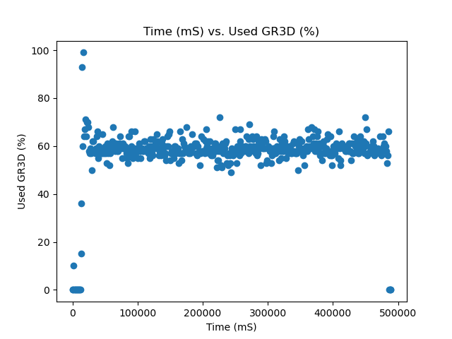
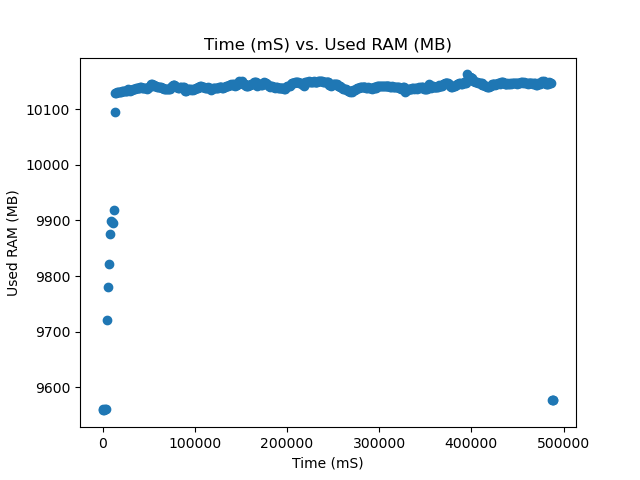
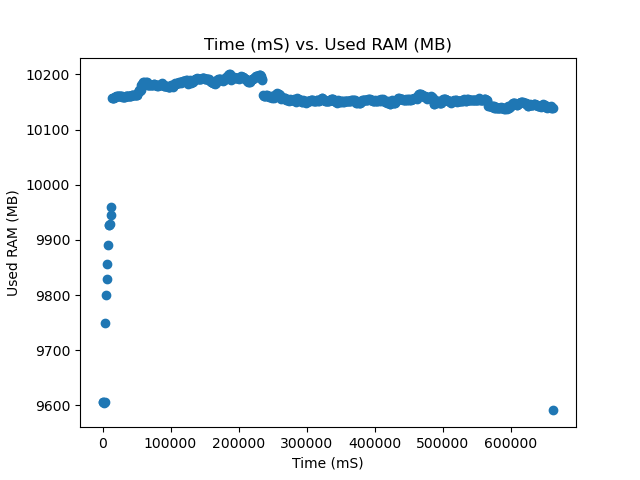
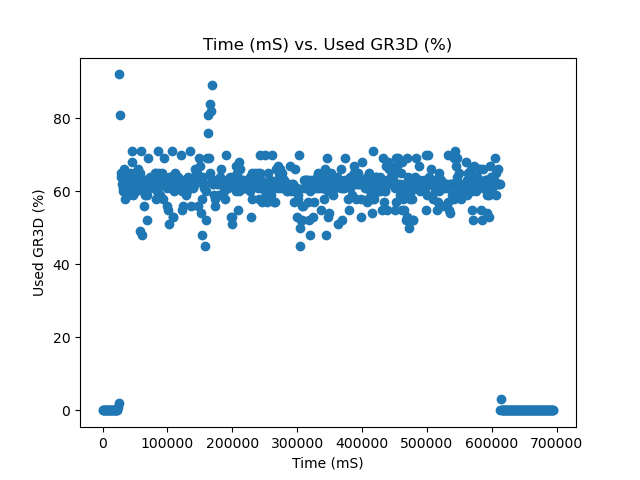
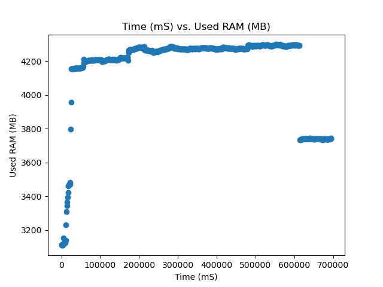
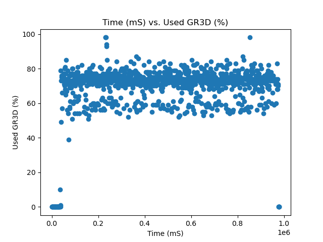

# Machine Learning Model Inference Performance 

This document will go over the performance of the Jetson AGX Orin 64 Dev Kit while inferecing over a variety of different common models. This is supposed to provide a reference baseline for developers to gather and understanding of how their models may performa on the SCALES system.

## Models Tested
- Resnet-152
    - Image classification
    - [Model Card](https://huggingface.co/microsoft/resnet-152)
    - Parameters: 60.3M

- Depth Anything V2
    - Depth Estimation 
    - [Model Card](https://huggingface.co/depth-anything/Depth-Anything-V2-Base-hf)
    - Parameters: 97.5M
- YOLO V8
    - Image Classification
    - [Model Card](https://huggingface.co/Ultralytics/YOLOv8)
    - Parameters: 3.2M

## Procedure 
Models were choosen from the hugging face model hub and then completed inference tests on the jetson. The hugging face transformer pipeline api as well as data sets were used to crate the inference enviroment and data. 

The data was collected using the [tegrastats data parser](https://github.com/ssaraff98/tegrastats_parser) which is able to read all the metrics from the jetson and save all the data into a csv file while also plotting some of the key metrics. 

If interested in other metrics Tegrastats records all of the following metrics:

- Time
- Used RAM
- Total Ram
- Number of Free RAM Blocks
- Size of Free RAM Blocks
- Used SWAP
- Total SWAP
- Cached SWAP
- CPU Frequency
- CPU 0-11 Load %
- Used GR3D %
- GR3D Frequency
- CPU Temperature
- tboard Temperature
- Temperature 
- tdiode Temperature
- gpu Tempurate
- tj Temperature

Each of the models were tested at all 4 of the Jetson power modes to show performance in resource constrained enviroments

## Resnet Results
The resnet model was tested using the [CIFAR100](https://huggingface.co/datasets/uoft-cs/cifar100) dataset.The team used the test split to inference 10,000 images.

<ins>Resnet Test Results</ins>

|Test|Average FPS|Average GPU %| Average RAM (MB)| Total Inference Time (s)|
| ----------- | ----------- | ----------- | ----------- | ----------- |
|MaxN| 21.01 | 57.16 | 10128.28 | 475.99  |
|50W| 15.27 | 51.36   |10153.84   |  655.08  |  
|30W| 16.91 | 52.13  | 4162.57  | 591.32  |
|15W| 10.58 | 68.48  | 4075.85  | 945.32   |

### Raw Data
[MaxN Raw Data](data/resnet_test.csv)
[50W Raw Data](data/resnet_50W.csv)
[30W Raw Data](data/resnet_30W.csv)

## Graphs
### MAXN Data

### 50W Data

### 30W Data

### 15W Data

