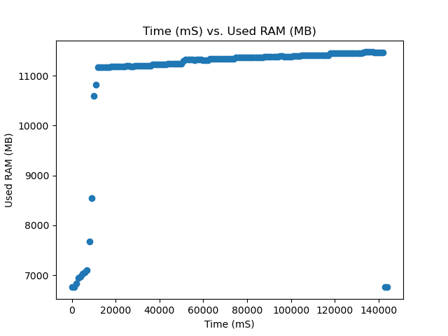
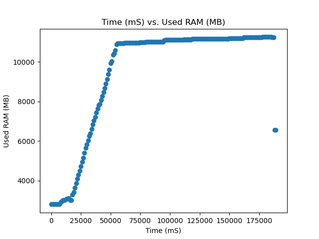

# Machine Learning Model Inference Performance 

This document will go over the performance of the Jetson AGX Orin 64 Dev Kit while inferecing over a variety of different common models. This is supposed to provide a reference baseline for developers to gather and understanding of how their models may performa on the SCALES system.

## Models Tested
- Resnet-152
    - Image classification
    - [Model Card](https://huggingface.co/microsoft/resnet-152)
    - Parameters: 60.3M

- Depth Anything V2
    - Depth Estimation 
    - [Model Card](https://huggingface.co/depth-anything/Depth-Anything-V2-Base-hf)
    - Parameters: 97.5M
- YOLO V8
    - Image Classification
    - [Model Card](https://huggingface.co/Ultralytics/YOLOv8)
    - Parameters: 3.2M
- Phi-3.5
    - Language Model
    - [Model Card](https://huggingface.co/microsoft/Phi-3.5-mini-instruct)
    - Parameters: 3.82B

## Reference Missions
 
 There is a couple of reference missions that can be represented through the use of the above models and play a factor in why they were choosen to conduct testing on. 

 Mission 1: 
 Using Classification Models
 Clssification Models are used to basically group images to certain "classes" this can be very useful onboard spacecraft because you can use them to filter incoming data streams to see if the images have target objects in them. A great example is with Earth Observation Satellites users want to know if the image taken has cloud cover in it or not, most customers buying imagery do not want to have clouds in their imagery as it increases the complexity of proccessing and provides less data. Classification algorithims running onboard can anazle the live stream of imagery or saved imagery to indentify cloud coverage in images and then priotrize downlinking the images without clouds in them. 

 Mission 2: 
 Using Depth Models
 Depth Esetmation models are used to estimate how far something is using camera imagery. This has many uses cases in space applications. The first is in RPO missions where cameras can be used to determine how far apart two spacecraft are and in real time update how two spacecraft are moving. The speed of depth estimation algorithims is quite benficial in time dependent situations like docking. 

 Mission 3: 
 Using LLMs

 LLMs are large language models that are used to converse in natural language and syhtensize data. As far as we are currently aware there hasnt been an active technology demonstration of these modesl deployed in space but they are very new and we believe there is a path to use in the future. We currently see use cases in basically allowing the satellites to have conversations with ground operators being able to ingest all the information about the satellite and then the user can ask questions about the state of the spacecraft and get a response in natural language. This is a longer timeline mission case but we felt like it was important to run a test using the one of the newest archetectures of models for developer refernce as the use of LLMs is expanding at a rapid pace. 

## Procedure 
Models were choosen from the hugging face model hub and then completed inference tests on the jetson. The hugging face transformer pipeline api as well as data sets were used to crate the inference enviroment and data. 

The data was collected using the [tegrastats data parser](https://github.com/ssaraff98/tegrastats_parser) which is able to read all the metrics from the jetson and save all the data into a csv file while also plotting some of the key metrics. 

If interested in other metrics Tegrastats records all of the following metrics:

- Time
- Used RAM
- Total Ram
- Number of Free RAM Blocks
- Size of Free RAM Blocks
- Used SWAP
- Total SWAP
- Cached SWAP
- CPU Frequency
- CPU 0-11 Load %
- Used GR3D %
- GR3D Frequency
- CPU Temperature
- tboard Temperature
- Temperature 
- tdiode Temperature
- tj Temperature

Each of the models were tested at all 4 of the Jetson power modes to show performance in resource constrained enviroments

## Data Set Description

The [CIFAR100](https://huggingface.co/datasets/uoft-cs/cifar100) is a commonly used dataset that contaains 50000 training images and 10000 test images that have corresponding labels that align to 100 different classes. The classes are completly mutually exlculsive. The data set is further broken down into smaller batches for each of the training and test sets. The test batch of images contains ramdonly selected images from all of the different classes in equal amounts. The training batch may have unequal amounts of each classes. Each images is only 32x32 pixels making them very small images basically thumbnail size. The purpose of using this dataset was that it was a small data set that was able to run quickly on the jetson for all the different model types. The team could conduct testing with larger size images but the general jist of performance will stay the same. Bigger images means longer run times. 

## Resnet Results
The resnet model was tested using the [CIFAR100](https://huggingface.co/datasets/uoft-cs/cifar100) dataset.The team used the test split to inference 10,000 images.

<ins>Resnet Test Results</ins>

|Test|Average FPS|Average GPU %| Average RAM (MB)| Total Inference Time (s)| Power Draw (W) |
| ----------- | ----------- | ----------- | ----------- | ----------- |----------- |
|MaxN| 21.015 | 59.07 | 7905.32 | 475.03 |14.78|
|50W| 15.27 | 52.39  |10161.1   |  655.08  |12.18|  
|30W| 16.91 | 61.29  | 4255.58  | 591.32  |12.72|
|15W| 10.64 | 72.35 | 3882.09  | 939.46  |10.16|

### Raw Data

- [MaxN Raw Data](data/resnet_test.csv)
- [50W Raw Data](data/resnet_50W.csv)
- [30W Raw Data](data/resnet_30W.csv)
- [15W Raw Data](data/resnet_15W.csv)

### Graphs
#### MAXN Data

#### 50W Data

#### 30W Data

#### 15W Data

## Depth Anything Results
The resnet model was tested using the [CIFAR100](https://huggingface.co/datasets/uoft-cs/cifar100) dataset.The team used the test split to inference 1,000 images.

<ins>Depth Anything Test Results</ins>

|Test|Average FPS|Average GPU %| Average RAM (MB)| Total Inference Time (s)|Power Draw (W)| 
| ----------- | ----------- | ----------- | ----------- | ----------- | ----------- |
|MaxN| 5.25 | 45.98 | 4453.77 | 190.54  |21.25|
|50W| 3.71 | 90.62   | 4967.38 | 269.25 |27.78|  
|30W| 1.53 | 93.67  | 4665.56 |  655.45 |15.13|
|15W| 0.83 | 95.95 | 4903.13 |1198.83   |11.91|

### Raw Data

- [MaxN Raw Data](data/depth_maxn.csv)
- [50W Raw Data](data/depth_50W.csv)
- [30W Raw Data](data/depth_30W.csv)
- [15W Raw Data](data/depth_15W.csv)

### Graphs
#### MAXN Data

#### 50W Data

#### 30W Data

#### 15W Data

## Phi-3 Results

<ins>Phi-3 Test Results</ins>

|Test|Tokens/s|Average GPU %| Average RAM (MB)| Total Generation Time (s)|Power Draw (W)|
| ----------- | ----------- | ----------- | ----------- | ----------- | ----------- |
|MaxN| 3.66 |60.78  | 11248.46 | 131.55 |13.99|
|50W| 3.60 | 49.75  | 10200.76|133.48 |12.54|  
|30W|  3.83 | 63.74 | 12136.26| 125.59  |14.07| 
|15W|  2.6 | 52.31 |  10752.25   | 184.66|11.33|

### Graphs
#### MAXN Data

#### 50W Data

#### 30W Data

#### 15W Data

## Notes

- The jetson power modes are designed to optimize for power draw which can limit the upper end of performance. For example when running the Phi-3 model in MaxN mode the GPU was running at the minium frequency of 300 Mhz and gets the 3.72 tokens/second. If the user is to manually edit the power modes to set the GPU frequency to the max of 1.3 GHz the jetson is able to produce ~8 tokens/second of performance. Now the downside is that you jump from ~20W of power draw to ~50W but this is an operational trade off between uptime and speed. 

- From the previous note we have noticed that this performance is only acheived on some models. This might be because of implemenation methodolies but for example we saw large performance increases with the phi-3 model but for the resnet and depth anything there was no impactful change in performance even when the GPU frequency was manually increased. 

- There may be other settings for each power mode that can continue to improve performance of models. The metrics data primarly use the default power states of of the Jetson

- There is a weird discrpancy in the NVIDIA documentation about the AGX Orin Power modes. So all the testing for this file has been done on a 32GB version of the AGX orin and the documentation says that there should be a 40W mode but there is only a 50W mode which is the documentation for the 64gb version of the board. additionally this board is having the max gpu frequency that is only supposed to be on the 64Gb version. So worried about the consistecny of the results on a 64gb board. 

Things to do still 

- Flash and test everything on a 64gb Jetson AGX Orin
- Yolo V8 inference testing
- 
