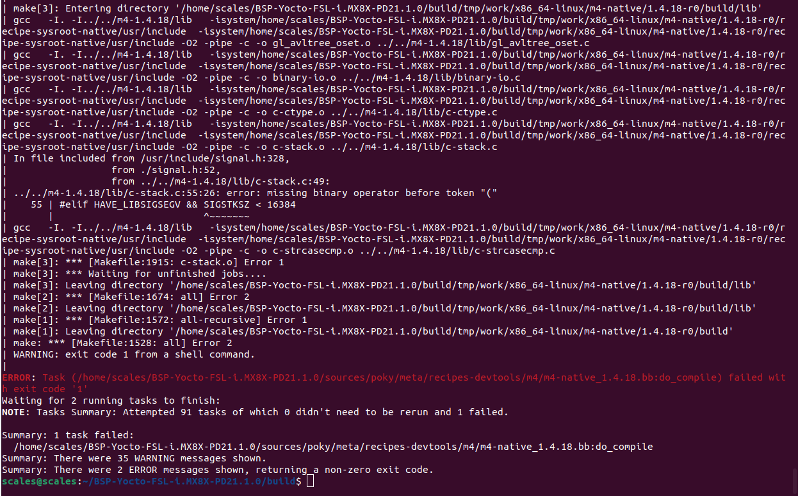
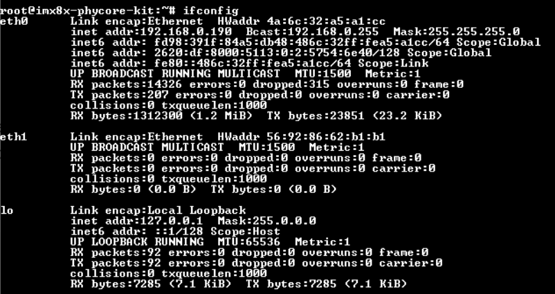
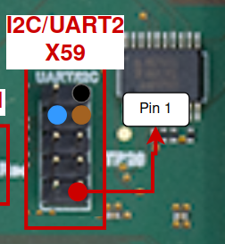
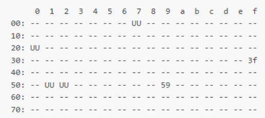
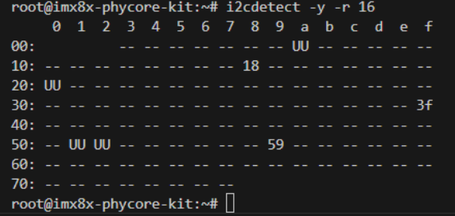

# i.MX 8X Testing Procedures

This document lists the interfacing and testing procedures required to get the i.MX 8X development board up and running for SCALES.

Important note: It is ideal to be using a 64-bit Linux host machine as opposed to Windows or a virtual machine. An ARM Cortex Linux machine will not work (cannot use a Jetson as host computer for development). 

## Yocto Linux BSP

It is very important to be using a 64-bit host computer with Ubuntu 18.04 installed. Any other version - especially newer versions of Ubuntu - will not build the BSP properly.

We followed [this guide to build the BSP](https://docs.phytec.com/projects/yocto-phycore-imx8x/en/latest/developingwithyocto/buildBSP.html). This documentation, as of February 2025, does not work properly on it's own. 

### Build Errors

At first, you may encounter some build errors while trying to run the `bitbake imx-image-multimedia` command in the "Start the Build" section of the guide. Most of these errors result from mistakes in the importing of other files and libraries in the code. To remedy this, we took the following steps:

1. Open `...BSP-Yocto-FSL-i.MX8X-PD21.1.0/sources/poky/bitbake/lib/bb/compat.py` on your host computer and make the import lines near the beginning of the code match the following:

```
from collections.abc import MutableMapping, KeysView, ValuesView, ItemsView
from collections import OrderedDict
from functools import total_ordering
```

Here, the change is to change the first import from `collections` to `collections.abc`, and to add the line `from collections import OrderedDict`.

2. Open `.../BSP-Yocto-FSL-i.MX8X-PD21.1.0/sources/poky/bitbake/lib/bb/persist_data.py` and match the beginning on your code to the following:

```
import collections
import collections.abc
import logging
import os.path
import sys
import warnings
from bb.compat import total_ordering
from collections.abc import Mapping
import sqlite3
import contextlib

sqlversion = sqlite3.sqlite_version_info
if sqlversion[0] < 3 or (sqlversion[0] == 3 and sqlversion[1] < 3):
    raise Exception("sqlite3 version 3.3.0 or later is required.")


logger = logging.getLogger("BitBake.PersistData")

@total_ordering
class SQLTable(collections.abc.MutableMapping):
```

Here, the change is adding the `import collections.abc` line and modifying the last line shown here to include `collections.abc.MutableMapping`.

3. Open `.../BSP-Yocto-FSL-i.MX8X-PD21.1.0/sources/poky/bitbake/lib/bb/data_smart.py` and match your import section to the following:

```
import copy, re, sys, traceback
from collections.abc import MutableMapping
import logging
import hashlib
import bb, bb.codeparser
from bb   import utils
from bb.COW  import COWDictBase
```

Here, the change is to add the line `from collections.abc import MutableMapping`.

After fixing those errors, there was another one that came up when trying to build:



Phytec support gave us the following guidance:

Here is a patch for fixing the dependencies.

The imx8x is on an older BSP. Github has deprecated *anonymous* use of the git protocol so the fetching is failing. This patch adds **.bbappend** files for all the failing recipes.

The bbappends files update the **SRC_URI** to use the **https** protocol, as well as define the **main** branch instead of master, which has been deprecated.

**Applying the Patch**

To apply the patch you will want to make a file called **0001-Fix-SRC_URI-git-protocol-changed.patch** in your meta-phytec folder. We used nano to do this.

```
cd Yocto/sources/meta-phytec/
nano 0001-Fix-SRC_URI-git-protocol-changed.patch
```

In the file you just created, paste the following and then save and exit the nano editor.

<details>
<summary>Click to toggle the patch file code.</summary>

```
From 21b454eafb3a5a61963a6d8ff53fdd8a8bd2a565 Mon Sep 17 00:00:00 2001
From: Garrett Giordano <ggiordano@phytec.com>
Date: Thu, 30 Jan 2025 11:38:13 -0800
Subject: [PATCH] Fix SRC_URI git protocol changed

Added protocol=https and branch=main to the following recipes:
 - glslang
 - spirv-tools
 - bmap-tools
 - googletest
 - teseract-lang

Signed-off-by: Garrett Giordano <ggiordano@phytec.com>
---
 .../recipes-graphics/tesseract/tesseract-lang_%.bbappend    | 4 ++++
 .../recipes-graphics/vulkan/glslang_git.bbappend            | 5 +++++
 .../recipes-graphics/vulkan/spirv-tools_git.bbappend        | 6 ++++++
 .../recipes-support/bmap-tools/bmap-tools_%.bbappend        | 4 ++++
 .../recipes-test/googletest/googletest_%.bbappend           | 4 ++++
 5 files changed, 23 insertions(+)
 create mode 100644 meta-phytec-fsl/recipes-graphics/tesseract/tesseract-lang_%.bbappend
 create mode 100644 meta-phytec-fsl/recipes-graphics/vulkan/glslang_git.bbappend
 create mode 100644 meta-phytec-fsl/recipes-graphics/vulkan/spirv-tools_git.bbappend
 create mode 100644 meta-phytec-fsl/recipes-support/bmap-tools/bmap-tools_%.bbappend
 create mode 100644 meta-phytec-fsl/recipes-test/googletest/googletest_%.bbappend

diff --git a/meta-phytec-fsl/recipes-graphics/tesseract/tesseract-lang_%.bbappend b/meta-phytec-fsl/recipes-graphics/tesseract/tesseract-lang_%.bbappend
new file mode 100644
index 0000000..1a34dce
--- /dev/null
+++ b/meta-phytec-fsl/recipes-graphics/tesseract/tesseract-lang_%.bbappend
@@ -0,0 +1,4 @@
+# Git has deprecated anonymous git:// protocol. Add protocol=https
+# master branch has been changed to main. Add branch=main
+
+SRC_URI = "git://github.com/tesseract-ocr/tessdata.git;protocol=https;branch=main;"
diff --git a/meta-phytec-fsl/recipes-graphics/vulkan/glslang_git.bbappend b/meta-phytec-fsl/recipes-graphics/vulkan/glslang_git.bbappend
new file mode 100644
index 0000000..fa29589
--- /dev/null
+++ b/meta-phytec-fsl/recipes-graphics/vulkan/glslang_git.bbappend
@@ -0,0 +1,5 @@
+# Git has deprecated anonymous git:// protocol. Add protocol=https
+# master branch has been changed to main. Add branch=main
+
+SRC_URI = "git://github.com/KhronosGroup/glslang;protocol=https;branch=main \
+"
diff --git a/meta-phytec-fsl/recipes-graphics/vulkan/spirv-tools_git.bbappend b/meta-phytec-fsl/recipes-graphics/vulkan/spirv-tools_git.bbappend
new file mode 100644
index 0000000..35e8bf3
--- /dev/null
+++ b/meta-phytec-fsl/recipes-graphics/vulkan/spirv-tools_git.bbappend
@@ -0,0 +1,6 @@
+# Git has deprecated anonymous git:// protocol. Add protocol=https
+# master branch has been changed to main. Add branch=main
+
+SRC_URI = "git://github.com/KhronosGroup/SPIRV-Tools.git;protocol=https;branch=main;name=spirv-tools \
+           git://github.com/KhronosGroup/SPIRV-Headers.git;protocol=https;branch=main;name=spirv-headers;destsuffix=${DEST_DIR}/spirv-headers \
+"
diff --git a/meta-phytec-fsl/recipes-support/bmap-tools/bmap-tools_%.bbappend b/meta-phytec-fsl/recipes-support/bmap-tools/bmap-tools_%.bbappend
new file mode 100644
index 0000000..220a048
--- /dev/null
+++ b/meta-phytec-fsl/recipes-support/bmap-tools/bmap-tools_%.bbappend
@@ -0,0 +1,4 @@
+# Git has deprecated anonymous git:// protocol. Add protocol=https
+# master branch has been changed to main. Add branch=main
+
+SRC_URI = "git://github.com/intel/${BPN};protocol=https;branch=main"
diff --git a/meta-phytec-fsl/recipes-test/googletest/googletest_%.bbappend b/meta-phytec-fsl/recipes-test/googletest/googletest_%.bbappend
new file mode 100644
index 0000000..7b95ce5
--- /dev/null
+++ b/meta-phytec-fsl/recipes-test/googletest/googletest_%.bbappend
@@ -0,0 +1,4 @@
+# Git has deprecated anonymous git:// protocol. Add protocol=https
+# master branch has been changed to main. Add branch=main
+
+SRC_URI = "git://github.com/google/googletest.git;protocol=https;branch=main"
-- 
2.25.1
```

</details>


You can then cd into your meta-phytec folder and apply the patch

```
cd sources/meta-phytec/
git apply 0001-Fix-SRC_URI-git-protocol-changed.patch 
```

You should then be able to build the BSP using 

```
bitbake imx-image-multimedia
```

---------

After applying those changes, the BSP built just fine, and we were able to use balenaEtcher to flash a microSD card for the i.MX using the `imx-image-multimedia-imx8x-phycore-kit.sdcard.bz2` image created during the build found in the `$BUILDDIR/tmp/deploy/images/imx8x-phycore-kit/` directory.

### Modifying the BSP

Following [this guide to modify the BSP](https://docs.phytec.com/projects/yocto-phycore-imx8x/en/latest/developingwithyocto/modifyBSP.html) we built in the previous section. We did not run into any issues when following this guide.

Add any packages from the list that you feel are relevant to your use case. When finished, you would have to re-flash the microSD card with the updated BSP and boot the i.MX with a clean install after each update.

## Connecting directly to the i.MX 8X

Connect to the dev board following the [Quick Start guide](https://docs.phytec.com/projects/yocto-phycore-imx8x/en/latest/quickstart/index.html#basic-evaluation-requirements). 

### Required materials

- i.MX 8X development board, with microUSB UART cable and power cable. 
- A Windows computer with Tera Term installed (or other serial communication software.) 

### Directions
1. Do not power the board yet. Connect the UART debug cable to X51 UART0 on the board, and the USB part into your computer. 

    - There are two serial ports that are specific to the i.MX 8X. One will be the debug terminal, and the other will be the main command terminal. Each different Windows host computer will have different names for these ports, so in the next few steps the ports COM15 and COM16 are example ports from Kelly’s computer. 
    - It is a good idea to open both serial ports that appear as options in Tera Term during your first setup, so that you know which ports are which for your specific computer. 

2. Start Tera Term (Windows computer). Select Serial COM15. Go to Setup > Serial Port. Change the speed to 115200. Press OK. 

    - COM15 is the command terminal. To see the debug terminal, follow the same steps for COM16. 
    - COM15 and 16 may be different on other computers. To be safe, set up both ports on the first boot to your device. 
    - Make sure to set them up before powering the board, or you will miss the sign in prompt. 

3. Plug in the DC power cable to power on the board. 

4. Sign in when prompted. Password is “root”. 


## Setting up Host Computer

Following [this guide to install the SDK](https://docs.phytec.com/projects/yocto-phycore-imx8x/en/latest/applicationdevelopment/InstallTheSDK.html) on the host computer. 

### Required materials

- 64-bit Linux host machine. 

### Directions
1. Once the SDK is set up on the host computer, it never needs to be done again. 

2. Be sure to source the environment before doing any work on the host computer: 
```
source /opt/fsl-imx-xwayland/5.4-zeus/environment-setup-aarch64-poky-linux
```
## Setting up Ethernet

### Required materials

- Windows computer with Tera Term installed 
- Ethernet cable 
- Router/Ethernet hub 
- i.MX 8X development board 

### Directions

1. Connect an ethernet cable from the router to an ethernet hub. Then connect another ethernet cable from your computer to the hub, and a third cable from the board to the hub. 

2. Test internet connection on the board. Press Ctrl+C to end the operation after the command runs for a while.
```
ping 8.8.8.8
```

3. Find the IP address of the board in Tera Term 
```
ifconfig 
```
    - The IP will be following the words “inet addr” under the ethernet port number you connected to. 
    - The following image shows the IP is 192.168.0.190 for eth0 
    - This may change each time you boot the board, so be sure to check.



4. Run VS Code and open a WSL terminal 

    - Good practice is to run the following: 
```
sudo apt-get update
```
5. Use `sudo apt-get install ssh` to update ssh if needed. 

6. Command to ssh into board: (make sure to update the IP) 
```
ssh root@192.168.0.145 -o HostKeyAlgorithms=+ssh-rsa -o PubKeyAcceptedAlgorithms=+ssh-rsa
```
7. Congrats you are now in the board on your computer. 

### Copying files over to the board

1. Make sure the board is connected to the host computer via ethernet.
2. Navigate to the directory with the file you would like to copy to the i.MX 8X. Use the following command to secure copy that file to the board. Fill in the blank for the file name and the IP address of the board.
```
cd <file directory>
scp -o HostKeyAlgorithms=+ssh-rsa -o PubKeyAcceptedAlgorithms=+ssh-rsa <file name> root@<ip address>:~
```
3. You should be able to see the file in the main directory of the i.MX 8X.

## I2C Interfacing

Following [this guide on I2C interfacing](https://docs.phytec.com/projects/yocto-phycore-imx8x/en/latest/interfaceguides/i2c.html). 

### Required materials

- MPC9808 Temp. Sensor with 4 female to female dupont wires 
- i.MX 8X development board 
- Windows computer with Tera Term installed 
- 64-bit Linux host computer 

#### Hardware Setup

Wire Legend: 

red - Vdd		black - Gnd		brown - SCL		blue - SDA 



red goes into pin 1 of X60. 

### Directions
1. Follow instructions for setting up ethernet. The following commands can be done either in Tera Term on a Windows machine connected to the board or in terminal ssh’d into the board from the Linux host computer. 

2. List the available I2C devices 
```
ls /dev/i2c*
```
3. Scan the board for devices 
```
i2cdetect -y -r 16
```
4. Default output: (time to play spot the difference to find your device’s address) 



Expected Output



my output (device address is 0x18) 

5. In the host computer’s terminal, source the correct cross-compiler for C code: 
```
source /opt/fsl-imx-xwayland/5.4-zeus/environment-setup-aarch64-poky-linux
```
6. Enter the C compiler directory: 
```
cd /opt/fsl-imx-xwayland/5.4-zeus/sysroots/x86_64-pokysdk-linux/usr/bin/aarch64-poky-linux
```
7. Run the code for the sensor: 
```
sudo ./aarch64-poky-linux-gcc -mcpu=cortex-a35+crc+crypto -fstack-protector-strong -D_FORTIFY_SOURCE=2 -Wformat -Wformat-security -Werror=format-security --sysroot=/opt/fsl-imx-xwayland/5.4-zeus/sysroots/aarch64-poky-linux -O ~/imx8x/i2c-temp-sensor/MCP9808.c -o ~/imx8x/i2c-temp-sensor/mcp9808a
```
Notes:

    - This path only works for C code. If you want to use C++, change the gcc at the beginning to g++. I am still trying to figure out how to do python code so stay tuned for that. 
    
    - Note: This code is from GitHub. It was listed as free to use, distributed with a free-will license (mentioned in first line of code comments). 

8. This code will generate an executable file. To run this code on the board, you may choose to use a USB flash drive or pull the code from our GitHub repo: 

 **USB:**

1. Copy the file to a USB and insert it in the board. Run the following commands on the board to set up the USB: 
```
echo host > /sys/kernel/debug/ci_hdrc.0/role
cd /sys/class/gpio/
echo 30 > export
echo out > gpio30/direction
echo 0 > gpio30/value
```
2. Check to make sure the sda1 is accessible by running: 
```
ls /run/media/
```
3. Run the code for the sensor by running: 
```
cd /run/media/sda1
./mcp9808a
```
4. You should see the temperature readings in the terminal. 

 **GitHub:**

1. The board must be connected to internet via wifi or ethernet for this method to work. 

2. Clone the scales-hardware GitHub repo to your home directory if you not previously done so.
```
cd
git clone https://github.com/BroncoSpace-Lab/scales-hardware.git
```
3. On the board navigate to the scales-hardware directory (this is a clone of our GitHub repo.) and update the repo 
```
cd scales-hardware
git add .
git pull
```
4. Then navigate to the imx8x folder and (optionally) view the files there. 
```
cd imx8x
ls
```
5. And run the code for the sensor in the same way as before: 
```
./mcp9808a
```
6. You should see the temperature sensor readings in the terminal.

## F Prime Test Deployment

We created a test deployment of F Prime version 3.5 found in [this repository](https://github.com/kdizzlle/fprime.git). Make sure the host computer is connected to the i.MX 8X via ethernet.

1. Use the following code to enter the F Prime directory on the host computer and source the F Prime environment:
```
cd fprime/fprime-hub-pattern-example
source fprime-venv/bin/activate
```
2. Use the following code to enter the Test Deployment directory on the host computer and secure copy the deployment to the board. Fill in the blank with the ip address if the board:
```
cd build-artifacts/imx8x/TestDeployment/bin
scp -o HostKeyAlgorithms=+ssh-rsa -o PubKeyAcceptedAlgorithms=+ssh-rsa TestDeployment root@<ip of imx8x>:~
```
3. Use the following command on the i.MX 8X to run the Test Deployment:
```
./TestDeployment -a 0.0.0.0 -p 50000
```
4. Use the following command on the host computer to launch the F Prime gds. Fill in the blank with the ip address if the board:
```
cd ..
cd dict/
fprime-gds -n --dictionary TestDeploymentTopologyDictionary.json --ip-client --ip-address <ip of imx8x>
```
