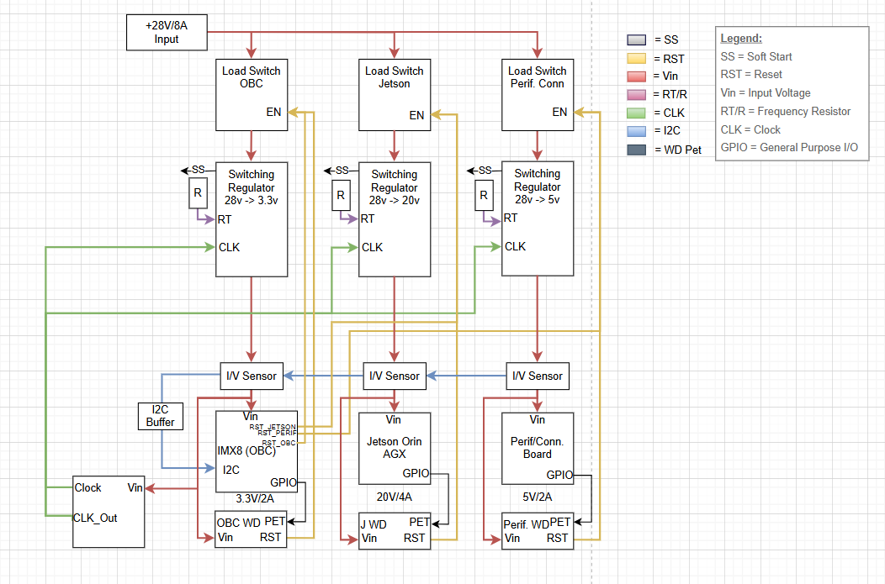
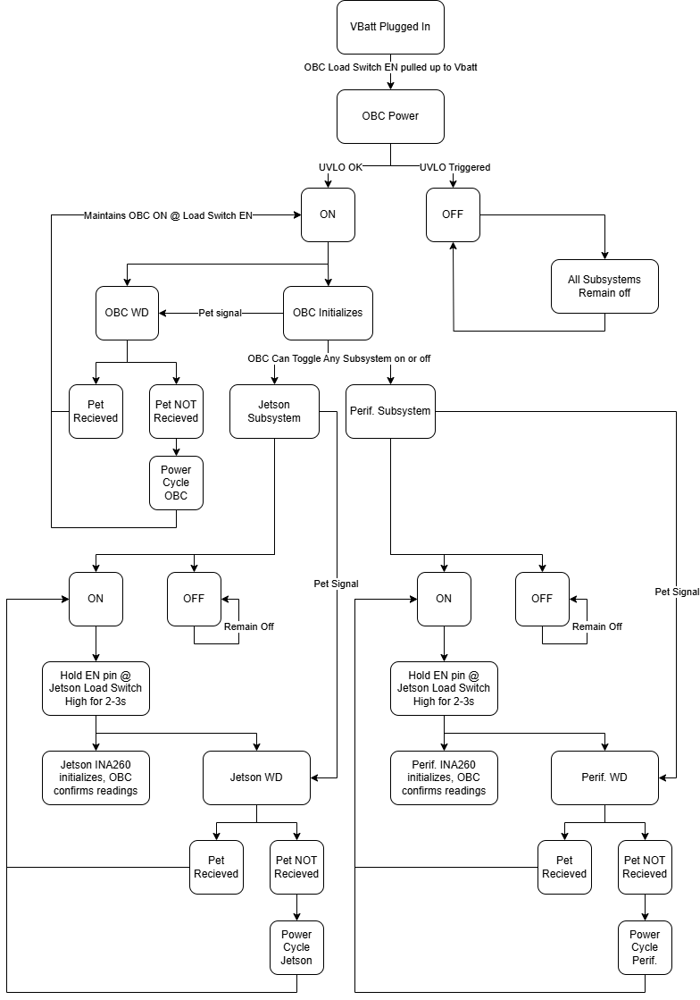
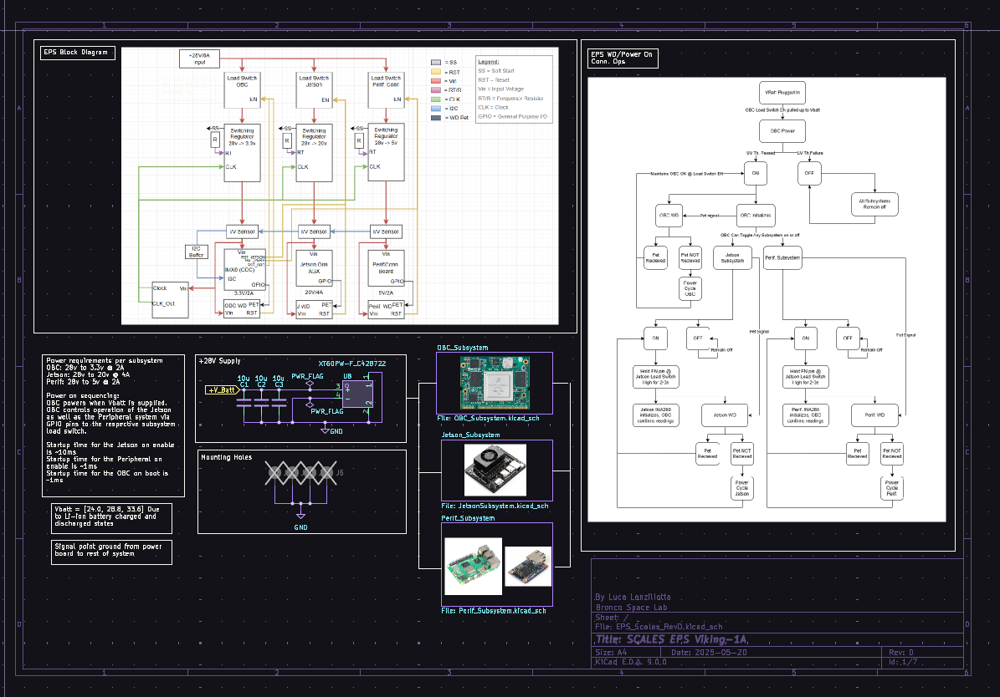
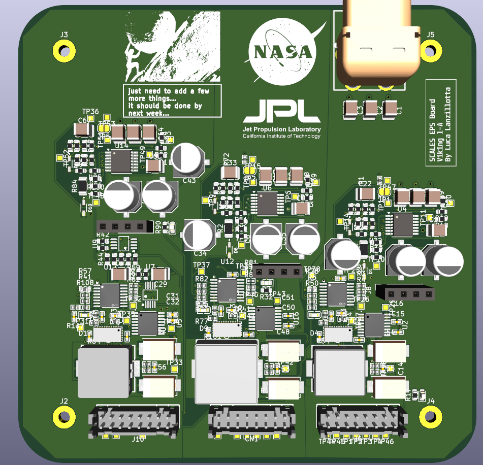
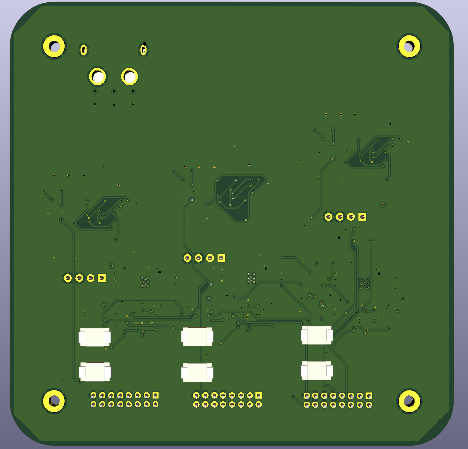

###  First Board Ordered ###
The first board that was ordered was based on the EPS SCALES REV D schematic and is the Viking 1-A board.
This board can be found on github with the commit titled the same name.
This board does have some production issues which were already fixed and committed under the same name.
The production errors that this board include are simple, which is why they are included under the same board revision, they are simply lack of copper fills over the remaining area of the board which were corrected by the manufacturer. Post evaluation and testing of the Viking 1-A board will allow for next design implementation and lead to the Viking 1-B board.

### List of Changes After Production Errors for Viking 1-A ###
Copper fills were missing around the majority of non power traces and were causing difficulties in manufacuring, this was corrected by JLCPCB by their fab engineers, but I took the liberty of adding the same type of corrections to the existing board version. These are included in the latest commit.

## EPS_REVD / Viking 1-A System Overview: ##

- Power Requirements (+28v 8A Max)
    - ML/Edge Computer - Nvidia Jetson (+20V 4A)
    - OBC/Flight Computer - IMX8 (+3.3V 2A)
    - Peripheral System - Raspberry Pi + Wiznet (+5V 2A)
- Component List
    - Load Switch + Controller: [TPS1HA08-Q1](https://www.ti.com/lit/ds/symlink/tps1ha08-q1.pdf?ts=1748448912035&ref_url=https%253A%252F%252Fwww.ti.com%252Fproduct%252FTPS1HA08-Q1)
    - Switching Regulator: [LT8612](https://jlcpcb.com/api/file/downloadByFileSystemAccessId/8589836477510287360)
    - IV-Sensor: [INA260AIPWR](https://jlcpcb.com/api/file/downloadByFileSystemAccessId/8589836477510287360)
    - Clock Generator: [LTC6902](https://www.analog.com/media/en/technical-documentation/data-sheets/6902f.pdf)
    - I2C Buffer: [TCA4307](https://www.ti.com/lit/ds/symlink/tca4307.pdf?HQS=dis-dk-null-digikeymode-dsf-pf-null-wwe&ts=1748986173530&ref_url=https%253A%252F%252Fwww.ti.com%252Fgeneral%252Fdocs%252Fsuppproductinfo.tsp%253FdistId%253D10%2526gotoUrl%253Dhttps%253A%252F%252Fwww.ti.com%252Flit%252Fgpn%252Ftca4307)
    - Comparator (WD Circuit): [TLV1704](https://www.ti.com/lit/ds/symlink/tlv1704-sep.pdf)
    - Subsystem Connector: [DF-11 (2x8)](https://www.lcsc.com/product-detail/Wire-To-Board-Wire-To-Wire-Connector_HRS-Hirose-HRS-DF11-16DP-2DSA-08_C530981.html)
    - Power Connector: [XT-60PWF](https://www.lcsc.com/product-detail/plug_Changzhou-Amass-Elec-XT60PW-F_C428722.html)
- Concept of Operations
    - OBC is the primary subsystem, which is always enabled. The OBC controls the ML and Perif. via load switches. OBC must hold the respective subsystem EN pin high for it to be active.
    - Each subsystem has a Watch dog that verifies its normal operation; in the case of a fault, the subsystem is disabled by its watch dog.
        - OBC: If the OBC hangs and fails to pet, it is power cycled, as the EN pin for its load switch is always held high with respect to the battery voltage
        - ML/Perif: If either of these subsystems hang and fail to pet, they are disabled until the OBC re-enables them.
    - Monitoring is done by the OBC via I2C from the INA260s, which allows the subsystem to get basic telemetry on the subsystem state of operation

## Block Diagram and Visual Con. Ops ##

* EPS RevD Block Diagram

    

* EPS RevD Concept of Operations

    

## **Board Schematic** ##
* Root

    

* Jetson Subsystem

    

* OBC Subsystem

    

* Perif. Subsystem

    
    
* Watchdog Circuit

    
    

## **Board Layout** ##

* Signal1 Layer

    
    
* GND Layer

    
    
* Power Layer

    
    
* Signal2 Layer

    
    
## 3D Render Front and Back ##
    
* Front

    
        
* Back   

    
        

## **Testing and Evaluation**

Using the on board test points and the expected probe locations based on the schematic, we can check if all the voltages are as required, if the watch dogs are behaving as expected, and if there are any components that may not be performing as required.

Overall Board:

- [ ]  TP 25, 31, 39 → 28v (Vbatt)
- [ ]  Mounting Holes → GND

OBC Subsystem:

- [ ]  TP 36 → EN
- [ ]  TP 32 → ~28v to Switching Regulator
- [ ]  TP 35 → SYNCPHASE1 (400Khz 0 deg out of phase)
- [ ]  TP 33 → Output of Switching regulator (~3.3V)
- [ ]  TP 34 → Output of INA260 (~3.3V)

WD_OBC:

- [ ]  TP 48 → Ensures WD is supplied with power
- [ ]  TP 49 → WD Input from OBC GPIO for pet
- [ ]  TP 53 → WD Open collector output, can only drive low, otherwise floating

Jetson Subsystem: 

- [ ]  TP 38 → Tests the GPIO input from the OBC/WD EN Pin (Should be held high when System is active, low on PET failure)
- [ ]  TP 25 → ~28v (Vbatt)
- [ ]  TP 26 → ~28v output from load switch
- [ ]  TP 27 → SYNCPHASE3 (400khz 180 deg out of phase from PHASE1)
- [ ]  TP28 → ~20v (Output from Switching regulator)
- [ ]  TP 29 → ~20v (Output from INA290 to Jetson Subsystem)
    
    WD_OBC:
    
    - [ ]  TP 10 → Check WD Supply power, should be 20v
    - [ ]  TP 11 → WD Interface input line, held high when there is a pet
    - [ ]  TP 47 Open collector output from the Watchdog, should be half of whatever the OBC GPIO pin voltage is when high, and then ground any other time

Peripheral Subsystem:

- [ ]  TP 39 → ~28v (Vbatt)
- [ ]  TP 82 → OBC GPIO input for EN line and WD En line, should be ~1.4v when high for OBC holding it high, and low when not held high.
- [ ]  TP 40 → ~28v output of the load switch
- [ ]  TP 41 → SYNCPHASE2 Output of LTC6902 (400khz 90 deg out of phase)
- [ ]  TP 42 → Input regulated power to the INA260, should be roughly +5v
- [ ]  TP 43 → output for the Peripheral subsystem, should be roughly +5v
    
    WD_Perif:
    
    - [ ]  TP 5 → 5v supply to power the watch dog
    - [ ]  TP 15 → WD Perif output always pulled low, should be low when the system is off, and held high when the OBC enables it, when the pet fails it will hold low until the subsystem turns off.